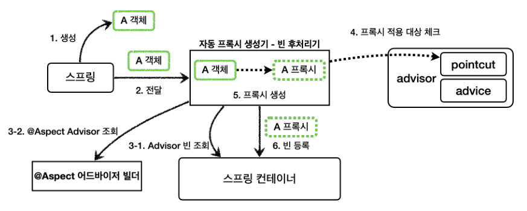

# item-service
springboot sample project (spring version 3.0.12)

### 스프링 기본
#### Filter
* log 필터 적용
* login 필터 적용 -> interceptor로 변경 적용
#### Interceptor 적용
* login 적용 -> Spring Security로 변경 적용
#### AOP 적용
* start/end 타임 출력 로그 적용 됨
#### Converter 적용
* integer to string
* ipport to string
* string to integer
* string to ipport
#### Formatter 적용
* number 적용
#### Session Manager 적용
* LoginContrllor에서 Login체크시 사용 -> Spring Security로 변경 적용되면서 미사용
#### Exception
* Exception resolver 적용
#### ArgumentResolver
* Login 적용 -> Spring Security로 변경 적용되면서 미사용
#### Validator 적용
* ItemValidator 적용
#### 메시지, 국제화적용
* error, message properties 적용
#### File
* 단일, 멀티 파일 업/다운로드 적용
#### JPA 적용
* 현재 H2 DB 연결
* AuditorAware 적용
#### Spring Security 적용
* UserDetail 적용(Session)
* OAuth 추가 적용 예정
* API Controller 대상 JWT 적용 예정
### 스프링 활용
#### AutoConfiguration
* memory.jar libs 추가
#### 외부설정과 프로필 적용
* local, dev, prod yml 분리
* -Dspring.profiles.active 설정에 따른 pay 로직(임시) 분기 처리
#### 액츄에이터 적용
* 기본path actuator -> manage로 변경 (Security에서 Admin만 접속 되도록 설정)
#### 모니터링(프로메테우스, 그라파나)
* 1차 : springboot -> 프로메테우스(DB) -> 그라파나 적용
* 2차 : springboot (push)-> 프로메테우스 push gateway <-(pull) 프로메테우스 -> 그라파나
* push gateway, 프로메테우수, 그라파나는 docker desktop으로 실행 (C:\Study\springMVC\docker)
* Timer, Counter, Gauge 적용
* HttpCounterConfig 구성(app 서버 ip, port 값 전달)
* pushgateway 서버 연결이 불가능 한 경우에 대한 예외처리는???
### 스프링 고급
#### 1) 커스텀 LogTrace 적용
* LogTrace의 TraceId 동시성 이슈를 쓰레드로컬로 해결
* Order orderList()에 적용
* 한계
  * 코드 중복성
  * 비지니스로직/공통로직 혼재
  * 공통로직 수정시 모두 찾아서 수정해 줘야 함
  * 해결책: 템플릿메서드패턴 적용
#### 2) 템플릿메서드패턴 적용
* Order add()에 적용
* 한계
  * 상속(자식클래스가 부모클래스의 기능을 전혀 사용하지 않지만 강하게 의존)
  * 해결책: 전략패턴 적용
#### 3) 전략패턴 (Context - Strategy)
* 전략패턴 (Context - Strategy)
  * Context : 변하지 않는 템플릿 역할
  * Strategy : 변하는 알고리즘 역할(비지니스 로직)
  * Context에 Strategy 구현제를 주입하는 형태 (스프링의 의존관계 주입이 바로 전략 패턴)
* 한계
  * 전략패턴은 선조립(선주입)후실행 방식
  * 조립이후 전략 변경이 번거롭다
  * 해결책: 템플릿콜백패턴 적용
#### 4) 템플릿콜백패턴 (Template - Callback) 적용
* 전략을 파라미터로 전달 받는 방식
  * Context -> Template
  * Strategy -> Callback
  * JdbcTemplate, RedisTemplate 등 XxxxTemplate 클래스가 대부분 이 패턴임
* Order processCancelBuy()에 적용
* 한계
  * 원본 비지니스 코드 수정이 일어남
  * 해결책: 프록시 패턴 적용
#### 5) 프록시(데코레이터) 패턴
* 아래 3가지 케이스 별로 원본 코드 수정하지 않고 LogTrace 도입하려면 Proxy패턴 적용으로 해결
  * 빈 등록 3가지 케이스
    * v1 인터페이스와 구현 클래스 - 스프링 빈으로 수동 등록 (Config에 @Bean으로 수동 등록)
      * ItemController (implements)
    * v2 인터페이스 없는 구체 클래스 - 스프링 빈으로 수동 등록 (Config에 @Bean으로 수동 등록)
      * MemberController (extends)
      * 빈 중복 등록 허용되어야 동작함 (application.yml 속성 추가 spring.allow-bean-definition-overriding: true)
    * v3 컴포넌트 스캔으로 스프링 빈 자동 등록 (@Service, @Repository로 자동 등록)
      * OrderController
* 프록시패턴: 접근제어가 목적
* 데코레이터 패턴: **객체에 추가 책임(기능)을 동적으로 추가**하고, 기능 확장을 위한 유연한 대안 제공
* 인터페이스기반 프록시(implements) vs 클래스기반 프록시(extends)
  * 인터페이스가 없어도 클래스기반으로 프록시를 생성할 수 있다.
  * 클래스기반 프록시는 해당 클래스에만 적용할 수 있다.
  * 인터페이스기반 프록시는 인터페이스만 같으면 모든 곳에 적용할 수 있다.
  * 클래스기반 프록시 제약사항
    * 부모 클래스의 생성자를 호출해야 한다.(super)
    * 클래스에 final키워드가 붙으면 상속이 불가능하다.
    * 매서드에 final 키워드가 붙으면 해당 메서드를 오버라이딩 할 수 없다.
* 한계
  * 너무 많은 proxy class가 필요하며, 중복 코드가 많이 발생함
  * 해결책: JDK 동적프록시 적용 
#### 6) JDK 동적프록시 
* 리플렉션
  * 리플렉션을 사용하면 클래스와 메서드의 메타정보를 사용해서 애플리케이션을 동적으로 유연하게 만들 수 있다.
  * 리플렉션 기술은 런타임에 동작하기 때문에, 컴파일 시점에 오류를 잡을 수 없다.
  * 리플렉션은 프레임워크 개발이나 또는 매우 일반적인 공통 처리가 필요할 때 부분적으로 주의해서 사용해야 한다.
* 프록시패턴의 단점 보완: 프록시 객체를 동적으로 런타임에 개발자 대신 만들어준다.
* JDK 동적 프록시는 인터페이스를 기반으로 프록시를 동적으로 만들어준다. 따라서 인터페이스가 필수이다.
* v1 ItemController에 적용 
  * 특정 매서드 이름의 조건 추가 PatternMatchUtils (edit 호출시는 skip 하도록 패턴 적용 함)
* InvocationHandler
* 한계
  * 인터페이스가 필수
  * 인터페이스가 없는 구체클래스 적용할 수 없음
  * 해결책: CGLIB 적용
#### 7) CGLIB: Code Generator Library
* v2 처럼 상속의 경우 사용
* MethodInterceptor
* 한계
  * 인터페이스 or 구체클래스 상황에 따라 일일히 별도 적용
  * 해결책: 프록시팩토리 적용
#### 8) 프록시팩토리(ProxyFactory)
* 인터페이스가 있는 경우에는 JDK 동적 프록시를 적용하고, 그렇지 않은 경우에는 CGLIB를 적용하고자 할 경우
* 공통 부가기능은 따로 만드는 것이 아니라 Advice에 적용
* Client -> ProxyFactory(분기) -> InvocationHandler or MehtodInterceptor -> Advice(공통부가기능) -> Target
* 프록시 팩토리의 기술 선택 방법
  * 대상에 인터페이스가 있으면: JDK 동적 프록시, 인터페이스 기반 프록시
  * 대상에 인터페이스가 없으면: CGLIB, 구체 클래스 기반 프록시
  * proxyTargetClass=true` : CGLIB, 구체 클래스 기반 프록시, 인터페이스 여부와 상관없음
* 포인트컷, 어드바이스, 어드바이저
  * 포인트컷(`Pointcut`): 어디에 부가 기능을 적용할지, 어디에 부가 기능을 적용하지 않을지 판단하는 필터링 로
  직이다. 주로 클래스와 메서드 이름으로 필터링 한다. 이름 그대로 어떤 포인트(Point)에 기능을 적용할지 하지 않
  을지 잘라서(cut) 구분하는 것이다.
  * 어드바이스(`Advice`): 이전에 본 것 처럼 프록시가 호출하는 부가 기능이다. 단순하게 프록시 로직이라 생각하면
  된다.
  * 어드바이저(`Advisor`): 단순하게 하나의 포인트컷과 하나의 어드바이스를 가지고 있는 것이다. 쉽게 이야기해서
  포인트컷1 + 어드바이스1 이다.
  * 조언자(`Advisor`)는 어디(`Pointcut`)에 조언(`Advice`)을 해야할지 알고 있다.
* 한계
  * Proxy 설정을 일일히 다 해줘야 함
  * v3 처럼 컴포넌트 스캔으로 등록된 Bean은 Proxy 설정 불가능 함
  * 해결책: 빈 후처리기 적용
#### 9) 빈 후처리기
* 객체를 조작할 수도 있고, 완전히 다른 객체로 바꿔치기 하는 것도 가능
* 스프링빈 등록 과정
  * 생성 -> 전달 -> 빈 후처리기(바꿔치기) -> 등록
#### 10) @Aspect프록시
* @Aspect를 보고 Advisor로 변환해서 저장
* Advisor를 기반으로 프록시를 생성
 